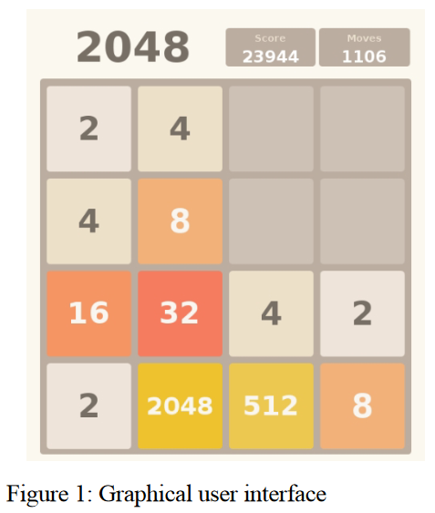
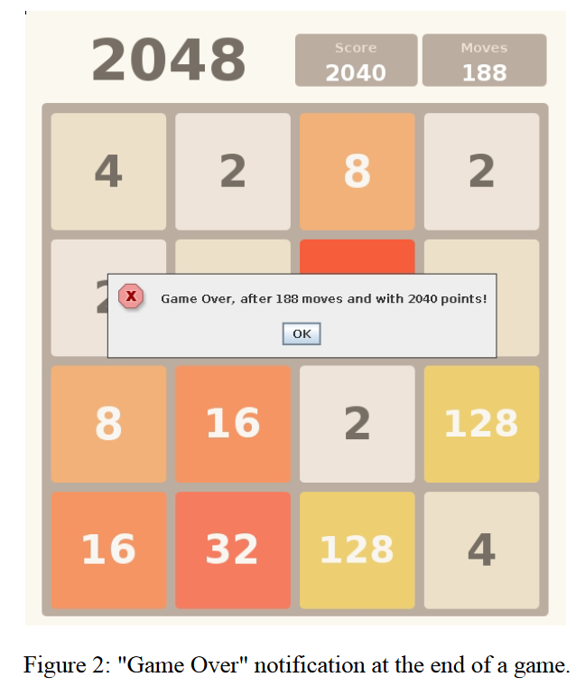
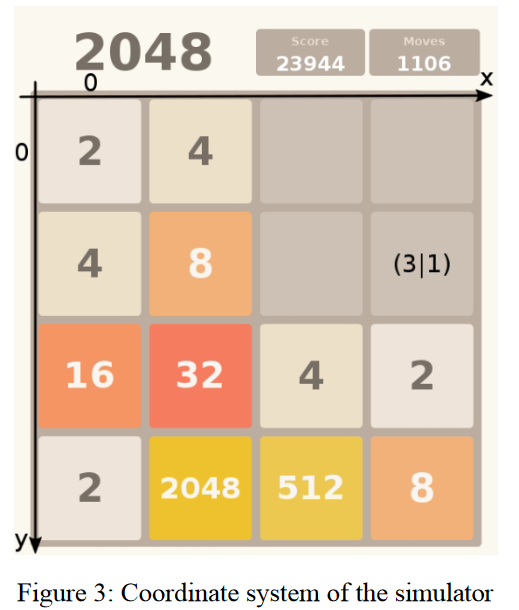
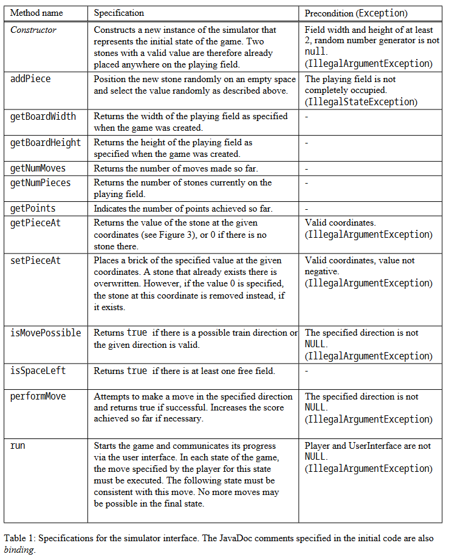
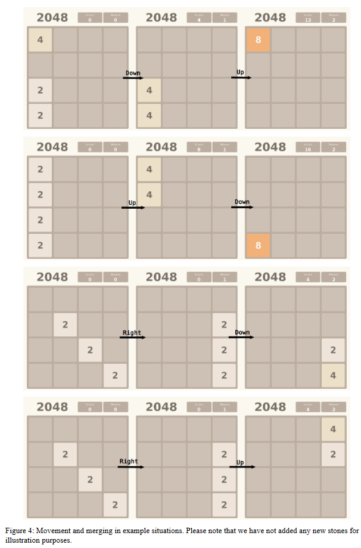

# 2048 (Java) - Developer

## The game
[2048](https://en.wikipedia.org/wiki/2048_(video_game)) is a puzzle game in which you have to move tiles around the board. The aim is to create pieces with increasingly higher values up to 2048. The game begins with two stones in random positions, which have a value of either 2 or 4. In each round, the player may choose a direction in which to move all the stones, if possible. A piece can only be moved if the neighboring square in the chosen direction is free. If there is a stone of the same value on the next occupied square in this direction, both are removed and a new stone is created on this square with twice the value of the two merged stones. After each round, a new stone is randomly placed on an empty space on the playing field. Like the initial tiles, it has a 90% probability of having the value 2 and a 10% probability of having the value 4. the game is lost as soon as there is no direction in which you can move the pieces on the board. This is the case if all the squares are occupied and there are no two pieces of the same value next to each other. In all other cases, you can either move pieces into the free spaces or merge adjacent pieces of the same value to form a new piece and thus gain a free space.

## The tasks
There are two conceptually different tasks in this project: Test creation and implementation. Test creation should be used to check the specification of the simulator. The implementation again consists of three parts:
- The simulator that contains the game logic

- The user interface that allows you to control the game (already implemented) and

- A computer player who plays fully automatically (bonus)

The individual parts are now described in detail

### The simulator
The game logic is implemented in the simulator, so it controls and regulates the course of the game. You must implement this yourself. At the start of the game, the playing field is initialized, i.e. two random pieces are placed in random positions and the first round begins. Each round follows the same principle: the player chooses a valid direction in which to move the stones and a new stone is placed. This continues until the board is completely filled with stones and no two of the same value are next to each other. If this is the case, a new round is not started and the game ends with a message ("Game Over"). This message also contains the final score and the number of rounds played (see Figure 2).

The rules for moving and merging the tiles are the same as in the [online version of the game](https://play2048.co/). In addition, the most interesting cases are explained graphically in Figure 4. Points are only awarded when merging and correspond to the value of the new pieces created by merging.

**Technical information** In the `SimulatorInterface.java` file, you will find the documented simulator interface, which you should implement using your own subclass. The specifications required for implementation and test control (see Table 1) are also contained there in the form of JavaDoc comments. As you are supposed to create tests for these specifications yourself, there are no public tests for the methods concerned. It is therefore advisable to first create the tests (see section 2.2) before you start implementing the affected methods. Please also note that preconditions of any kind must be checked: If the precondition of a method is violated when it is called, the exception specified in Table 1 must be thrown.

You can obtain an instance of the simulator using the static method `createSimulator` of the `TTFEFactory` class. Implement this method so that it returns an instance of your implementation.

### Test creation
To define how an implementation
should behave, we have defined specifications in Table 1. If one of these specifications is not met, an implementation is considered faulty, otherwise it is considered correct.

**Restrictions** The evaluation of your tests is subject to certain restrictions:

- Your tests only need to instantiate the simulator with a playing field width and height of 4.

- Your tests do not need to check whether random effects are actually random or deterministic.

- Your tests do not need to check whether the preconditions are ensured by the simulator.

- Regarding the `run` method, your tests only need to ensure that the game ends in a state where no more moves are possible.

**Technical notes** All tests used to evaluate this task must be implemented in the Java package `ttfe.tests` (without further sub-packages). It is irrelevant whether you use several classes or not. If you want to implement auxiliary methods/classes for your tests, these must also be implemented in this package. In addition, only the classes and interfaces and their methods from the ttfe package specified at the beginning are available to your tests. Their implementation, in particular that of the `TTFEFactory`, is provided by us. You receive an instance of the interface to be tested via the `TTFEFactory.createSimulator` method.

Make sure that your tests test the behavior of the simulator in such a way that an `AssertionError` (or a subclass) is thrown if the implementation is found to be faulty.

### The computer gamer
At the end of the project, you should write a computer player that tries to "win" as many games as possible instead of a human. Just like a human, your computer player can assess the current state of the playing field and, depending on the complexity of your implementation, also take into account the possible subsequent rounds. Your computer player should return a (hopefully valid) move for the given state.

While the dimensions of the playing field are not fixed in the simulator, it is sufficient if your computer player works on a 4x4 playing field. The game also runs under a time limit: a game is automatically declared over after a maximum of 10 seconds automatically declared over. You receive the points scored up to that point. How many project points you receive for your computer player depends on how far he gets on average. If your computer player reaches a 2048 stone in half of the games, you will receive all bonus points.

You can call any methods on the simulator object in your computer player, in particular methods that change the state of the playing field. However, before the move selected by the computer player is executed, the previous state of the simulator is restored. Please also note that the simulator does not necessarily generate the new piece on the same field as when you call its `addPiece` method in your computer player, as pieces are always generated at random free positions.

Implement the computer player by implementing the player interface from `PlayerInterface.java` with your own subclass. The computer player is then requested via the `createPlayer` method of the `TTFEFactory` class. Implement this method so that it returns an instance of your computer player.

## Main
Once you have implemented the simulator, you can also play and try out the game yourself via the user interface. To do this, `execute` the Main method in the `TTFE.java` class. The program accepts four optional parameters in any order:
1. The seed for the random number generator, if omitted 0: `--seed N`

2. The width of the playing field, if omitted 4: `--width N`

3. The height of the playing field, if omitted 4: `--height N`

4. Whether a human or computer should play, omitting h(uman): `--player [h | c]`

As in the online version, the game is controlled using the arrow keys.

## Testing and debugging in Visual Studio Code
The easiest way to execute and debug individual tests is via the test panel. All tests in the project are listed here, grouped according to the Java package and the Java class in which they are located. As already mentioned, your tests are located in the `ttfe.tests` package. After executing a test, an editor window opens with a summary. Here you can see which tests have passed, as well as additional information about failed tests which can be useful for debugging. Each new test you create is listed in the test panel.