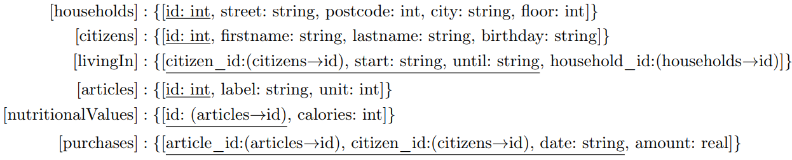

# Natural Language to SQL (SQL) - Developer
Given the following relational schema, which is based on the data set from the notebook `NSA.ipynb`.

Your task is to translate the following natural language queries into appropriate SQL queries. You can test your queries by pasting them into the space provided in the attached notebook. Note that dates (_start_ and _until_ in `livingIn`, _birthday_ in `citizens`, and _date_ in `purchases`) in this schema always follow the format `YYYY-MM-DD HH:MI:SS`. 

1. Identify the households that have a 13 as their house number and in which at least two citizens born before 1920 have lived or still live there. Your output should consist of the following values ​​and be sorted in ascending order by street name: 

- The street of the household as "Straße", 

- The postal code of the household as "PLZ", 

- The city of the household as "Stadt". 

Note: The house number is always at the end of the _street_ attribute in `households`. 

2. For each individual item, identify which citizens bought the most of it in one purchase. The output should consist of the following values ​​and be sorted in descending order by the name of the food and also only contain the first 10 tuples:

- The name of the food as "Bezeichnung",

- The maximum amount (in liters or kilograms) of this item that was bought in one purchase as "Menge",

- The first name of the citizen as "Vorname",

- The last name of the citizen as "Nachname"

3. Identify the citizens who moved into exactly two households between 1900 and 1949 (both inclusive). In addition, calculate the calories purchased by these citizens in the period between 1900 and 1949 (both inclusive). The output should be sorted in descending order by calories purchased:

- The citizen's first name as "Vorname",

- The citizen's last name as "Nachname",

- The total calories purchased by this citizen during this period as "Kalorien".

Note: The calories in nutritionalValues ​​are given in kcal/100g, while the amount of the purchased item in purchases (amount) is given in kg. So you need to convert kcal/100g to kcal/kg.
