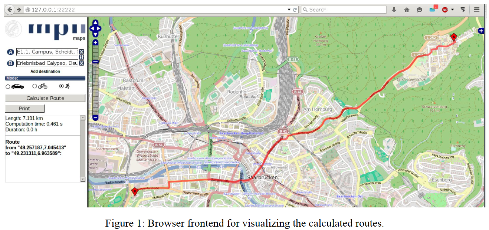
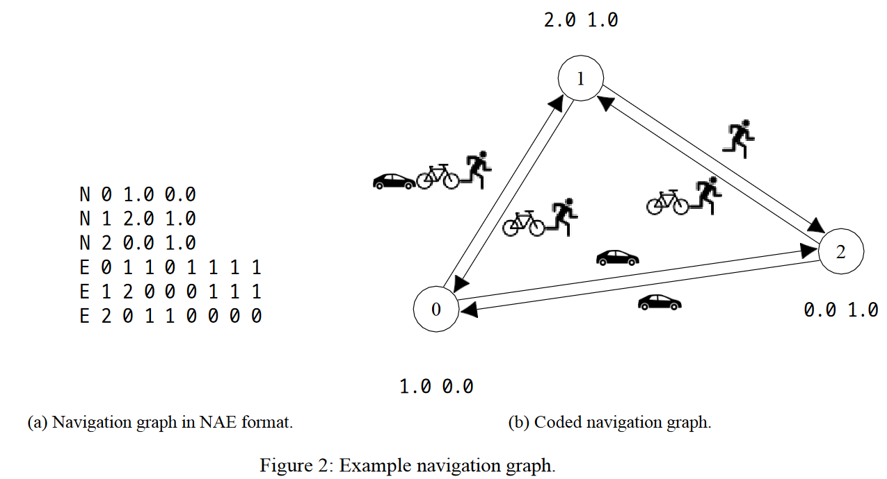
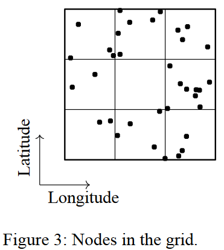
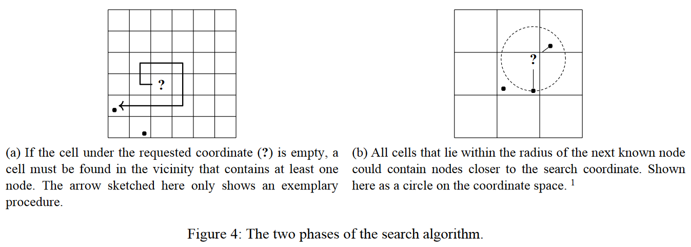
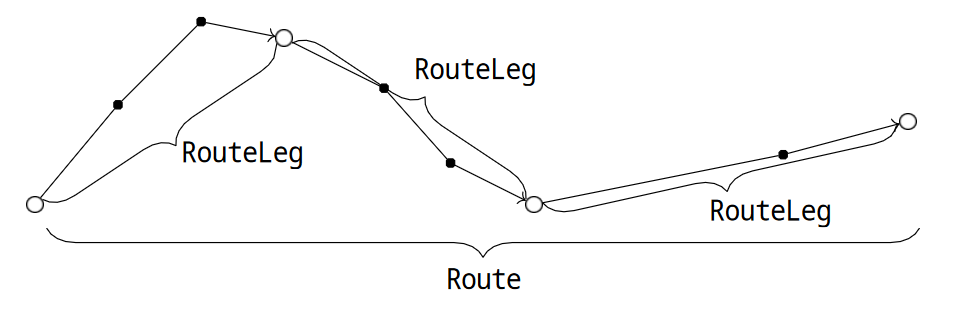
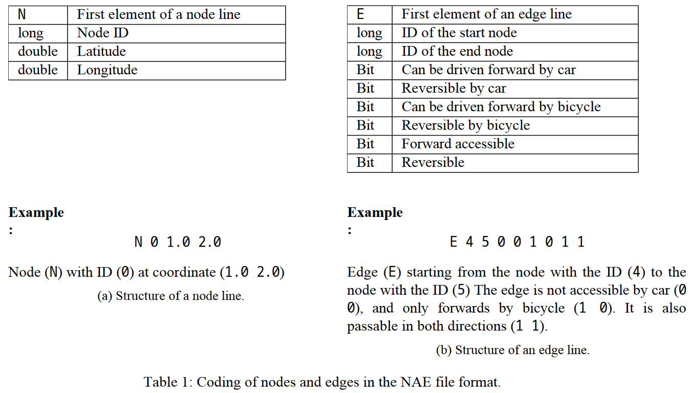

# Route Planner (Java) - Developer

In this project, you will implement a route planner in Java. This should calculate the shortest route for given coordinates that can be used with the selected means of transportation. In addition to the three different means of transportation, it should also be possible to specify intermediate points via which the route must pass. 

In addition to some maps, we provide you with the browser frontend from Figure 1, as well as the parts required to communicate with the frontend. The frontend was developed as a prototype in the [Software Engineering lecture in 2012](https://www.st.cs.uni-saarland.de/edu/se/2012/). It already served the groups of the [Algorithm Engineering lecture](https://resources.mpi-inf.mpg.de/departments/d1/teaching/ss12/alg_eng/) as a debugging and visualization aid, but is not necessarily free of minor bugs and problems.

The navigation graph encoded in the NAE files uses [Open Street Map (OSM)](https://www.openstreetmap.de/) "identifiers" (ID) to identify the nodes. To display the corresponding node on a map, you can use the various OSM web interfaces. As an example, the node with the ID 1597767486 is visualized at the following address:

http://www.openstreetmap.org/node/1597767486

Please note:
- The JavaDoc comments in the interfaces are part of the specification and therefore supplement this document.

- You must not change or add to the interfaces supplied; the same applies to the `Coordinate` and `CoordinateBox` classes. If you require additional attributes or methods, you can implement this with an [`Adapter`](https://en.wikipedia.org/wiki/Adapter_pattern), for example.

- To avoid timeouts (and thus failures) during the tests, follow the instructions on efficiency and runtime for the individual tasks.

- Write your implementation exclusively in the Java package `routing`.

## Tasks
### Read maps and build navigation graph 
We provide you with maps in the NAE format specially designed for this project. The maps describe a navigation graph (`Graph` interface) consisting of nodes (`Node` interface) that are connected by edges (`Edge` interface). Your task is to implement the `Factory.createGraphFromMap` method. You can also create an auxiliary class (e.g. `GraphFactory`) for this purpose if you feel it makes sense.

The argument of the `createGraphFromMap` method is a path to an NAE file that you need to read in. A `Graph` that corresponds to the navigation graph encoded in the file is expected as the return value.

You can see an example navigation graph in Figure 2b. The coding of the example graph in NAE format is shown in Figure 2a. The graph consists of edges that describe paths between nodes. The position of the nodes is specified in latitude and longitude. The `Coordinate` class represents such a coordinate. Since not all paths are accessible for all means of transport in both directions, your `Edge.allowsTravelType` implementation must take into account in which direction the edge should be taken with which means of transport. We distinguish between three types of transportation, described by the `TravelType` enumeration type: car (`CAR`), bike (`BIKE`) and foot (`FOOT`). The enumeration type `TravelType` has an additional value `ANY` to indicate that each edge may be taken as long as it can be used with any means of transport in the specified direction.

**Notes**
- If the given path does not exist, the method should throw a `FileNotFoundException`.

- To implement an efficient read-in method, you cannot use a linear search when reading in the edges to find the matching start and end nodes of an edge. Instead, use a suitable data structure to efficiently access the corresponding object using the ID of a node.

- Two edge objects must be created for each edge from A to B: one is placed in the start node A and destination B, the other with start B and destination A in the end node. Note that the edge added to the end node must have exactly the inverse path rights of the edge added to the start node.

### Simplify graph
The graph interface provides two methods with which the navigation graph can be simplified.
- `removeIsolatedNodes` removes all nodes from the graph that have no outgoing edges.

- `removeUntraversableEdges` specializes the graph for a given `RoutingAlgorithm` and `TravelType`. All edges that may not be used with the given means of transportation must be removed from the graph. If it is a bidirectional `RoutingAlgorithm`, you must obtain edges that may be used in the opposite direction. The `RoutingAlgorithm.isBidirectional` method provides information as to whether the `RoutingAlgorithm` is bidirectional.

**Notes** 
The two methods should not be used in your routing algorithm. They are currently used for display with the help of the front end.

### Find next node
A proper route planner calculates the shortest route based on coordinates and finds nearby graph nodes automatically. In this task, you will implement the `NodeFinder` interface, which returns the nearest node to a coordinate. The problem is commonly known as *1-Nearest Neighbor*. The distance measurement between two coordinates is pre-implemented in the `Coordinate.getDistance` method. On smaller navigation graphs, you can run through all the nodes to find the nearest node. On large maps, however, you will encounter runtime problems. For this reason, you will implement an accelerator structure in this task, with the help of which you no longer have to iterate over all nodes for repeated requests for the next node.

A simple acceleration structure consists of placing a grid over the map and
placing the nodes in a set per grid cell. You can see an example in Figure 3. Since the edges do not play a role in this problem, you will only see the points that represent the nodes of any navigation graph. In the following, we will go into the structure of the grid structure and discuss the two phases of the search algorithm on the accelerator structure (`NodeFinder.getNodeForCoordinates`).

**Design of the acceleration structure**
A linear search can be used to search for the next node within a grid cell. When setting up the grid, select a suitable number of cells and sort the nodes into them

**Find a nearby node**
In the first phase, a node is searched for that is not necessarily the next one. You can see an example procedure in Figure 4a. The second phase works more efficiently the closer this approximate solution is to the search coordinate.

**Find the next node**
The second phase obtains the distance of the approximate solution and examines all cells that could contain closer nodes. Assume that a node and its distance to the search coordinate are known. As can be seen in Figure 4b, it is then not sufficient to search for the next node only in the cell of the approximate solution. Instead, the search for the next node can only be restricted to the nodes that lie within the distance of the approximate solution. The `Coordinate.computeBoundingBox` method calculates intervals of latitude and longitude for a coordinate and a radius, in which even closer nodes could lie. Use this method to determine which cells you still need to examine for closer nodes.

**Notes**
- All methods of the `NodeFinder` interface must be implemented for this part of the project.

- The `CoordinateBox` and `Coordinate` classes already contain functions that you may find useful, in particular `Coordinate.computeBoundingBox`.

- The acceleration structure does not have to be able to handle the empty graph.

- Your implementation does not have to take into account the case that a map contains a pole, nor the jump
in longitude from 180°E to 180°W.

- Determining a suitable number of cells is part of the task and can have a major impact on the efficiency of the acceleration structure.

### Calculate shortest distances
The core of any route planner consists of calculating the [shortest routes](https://en.wikipedia.org/wiki/Shortest_path_problem) (also known as paths or routes). There are also a large number of possible solutions in this part of the project. This time, however, it is largely up to you which of these you actually implement. Your implementation only has to find the shortest path in the given time. In order not to exceed these time limits, you should implement a standard algorithm that cleverly searches the graph. A simple algorithm is explained below and is also used by the reference implementation as a basis for estimating the time required.

**Dijkstra's algorithm**

[Dijkstra's algorithm](https://en.wikipedia.org/wiki/Dijkstra%27s_algorithm) is the fastest known algorithm for calculating the shortest path between two nodes (With respect to the asymptotic term (U-notation) and under some conditions on the graphs).

The idea is to search the graph from the start node. Only unvisited nodes are considered and a preliminary shortest path is calculated. As soon as the algorithm finds the target node during this search, you can be sure that you have also found the shortest path.

In the implementation, both a *set* and a *priority queue* are used for this purpose. Both are empty at the start of the search and are filled with the visited or found nodes during the search. A node is *found* if it is a neighbor of the current node and you are allowed to use the connection (`Edge`) with the selected means of transport. The set is used to avoid visiting a node twice; the priority queue stores the nodes found sorted according to their distance from the start node.

Note that the distance here is not the straight line between the nodes (i.e. the distance of the coordinates), but the length of the shortest path through the navigation graph. If the nodes that can be reached transitively from the start node are now visited in the order in which they are stored in the priority queue, the shortest paths from the start node to all visited nodes are implicitly calculated. If the destination node is visited, the search can of course be terminated. If there is no route between the start and destination nodes with the selected movement type, the entire graph reachable from the start node is visited.

**Note:** You do not have to implement a *priority queue* yourself, but can use the [`PriorityQueue`](https://docs.oracle.com/en/java/javase/16/docs/api/java.base/java/util/PriorityQueue.html) from the `java.util` package. Note that the objects you want to sort must implement the interface [`Iterable<T>`](https://docs.oracle.com/en/java/javase/16/docs/api/java.base/java/lang/Iterable.html). Make sure you know beforehand what happens if the value used for sorting changes while the object is still in the priority queue.

**Modeling the route**

The `Route` and `RouteLeg` interfaces are intended to describe a calculated route. We provide you with the abstract classes `RouteBase` and `RouteLegBase`, which already pre-implement the functionality required for the web frontend. You can extend these two classes with your implementation.

There are two methods in the `RoutingAlgorithm` interface for calculating routes: `computeRouteLeg`
and `computeRoute`. These reflect the fact that users can search for a direct route between two waypoints
(`RouteLeg`) or for a route via several predefined waypoints (`Route`). However, a `Route` is made up of several
`RouteLeg` objects that describe the individual stages.

Notes
- A `RouteLeg` or a `Route` via a series of `Node` objects is only consistent if each `Node` object in the row contains an `Edge` that starts at this `Node` and ends on the next node, except for the last one. In addition, each of these `Edge` objects must be usable in the forward direction.

- Implement the `RoutingAlgorithm` interface and the `getRoutingAlgorithm` method in the `Factory` class.

- If you are not satisfied with the speed of the algorithm, you can implement an extension, e.g. the [A* algorithm](https://en.wikipedia.org/wiki/A*_search_algorithm). The distance to the target node can be used as a heuristic (see `getDistance` method of the `Coordinate` class).

## Bonus tasks
### Bidirectional Dijkstra algorithm
The `RoutingAlgorithm` interface and the access rights annotated in both directions on the edges make it possible to use a bidirectional algorithm. Bidirectional means that edges are not only followed forwards in order to get from the start to the destination, but that edges are also traversed in the opposite direction in order to search from the destination to the start. As this happens "simultaneously", you have to visit fewer nodes on average to find the shortest path. 

In this bonus task, you should now implement Dijkstra (or A*, etc.) bidirectionally. Note that, in contrast to the unidirectional algorithm, the first path found from the start to the destination is not necessarily the shortest. Before you start this task, make sure you understand why this is the case (using our minimal example graph if necessary). Also think about how to deal with asymmetric edges (e.g. only one direction accessible by car).

### Fast routing through intersection graphs
All nodes that can also be found on OSM are entered in the navigation graphs provided. While isolated nodes have already been removed when simplifying the graph, there are still nodes that are more of a hindrance than a help when finding the shortest route. Such nodes have exactly two connections to the rest of the graph. During the route search, such nodes are visited via one of these edges and left again via the other. After that, they can never be visited again, so they only establish a connection between their two neighbors. There are many such nodes, especially in long roads and curves, as they allow the real course of the road to be visualized (alternatively, there would be a straight line between their intersection nodes).

In this bonus task, you are to calculate an *overlay graph* for the navigation graph in which all the nodes described above have been removed . This means that it only contains intersections and dead ends. When removing the nodes, you must adjust the edges so that connections between intersections are not lost (or distorted). In addition, it should be possible to calculate the shortest route between any points on this intersection graph, just like on the original. To do this, you must first use the original graph to calculate the routes up to the next intersection. The rest of the route can then be calculated on the intersection graph.

## The NAE file format
An NAE file (**N**ode **A**nd **E**dge) is made up of individual lines, whereby all characters are encoded in ASCII. Each line consists of individual elements that are separated from each other by a space. The first element of each line encodes how the line is to be interpreted. There are two possibilities: If the line begins with an `N`, it is the description of a node; if it begins with an `E`, it is the description of an edge.

The exact structure of the two line types is described in Tables 1a and 1b. There, the first column indicates the type, alongside a description in the second column.

Please note that `bit` can stand for the character `1` or `0`. A `1` means that the property applies, a `0` means that it does not apply. `long` stands for an integer (all node IDs are unsigned). `double` describes a decimal number that fits into the value range of the Java type of the same name. The decimal point is coded with a dot '`.`'.

To simplify the reading process, NAE files are also sorted so that all nodes are written to first and then the edges.

**Notes** 
The following applies to all NAE files on which we will test your implementation:
- A node ID never appears in several node rows.

- The edge lines only refer to nodes that were previously introduced via a node line.

## Maps
During this process, it may happen that paths do not have the same access rights as in the original OSM data due to the unmanageable number of annotations.
- [minimal.nae](/Programming2_SS21/Project5/minimal.nae) - a minimal test graph
- [campus.osm.nae](/Programming2_SS21/Project5/campus.osm.nae) - Uni Campus
- [saarbruecken.osm.nae](/Programming2_SS21/Project5/saarbruecken.osm.nae) - Saarbrücken city area
- [saarland.osm.nae](/Programming2_SS21/Project5/saarland.osm.nae) - Saarland

## Browser frontend
We provide you with a simple server that you can start locally on your computer. To do this, execute the main method in utils/Server.java in Visual Studio Code and open the URL `http://127.0.0.1:22222` with a web browser.

The server uses your implementation to first determine nodes from coordinates and then calculate the shortest route between these nodes. The route is then displayed in your browser.

Please note that you need an Internet connection to load the background graphics and the coordinates from [OpenStreetMap](https://www.openstreetmap.de/).